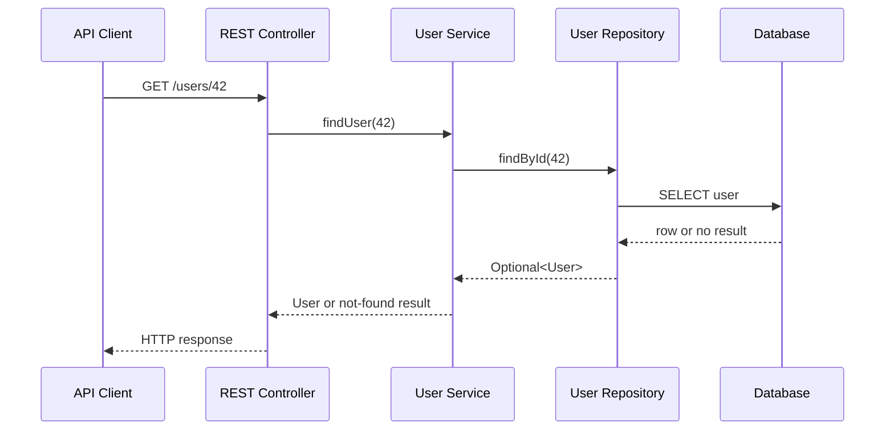

# Spring Boot User Lookup Sequence

```mermaid
sequenceDiagram
    participant Client as API Client
    participant Controller as REST Controller
    participant Service as User Service
    participant Repository as User Repository
    participant DB as Database
    Client->>Controller: GET /users/42
    Controller->>Service: findUser(42)
    Service->>Repository: findById(42)
    Repository->>DB: SELECT user
    DB-->>Repository: row or no result
    Repository-->>Service: Optional<User>
    Service-->>Controller: User or not-found result
    Controller-->>Client: HTTP response
```
